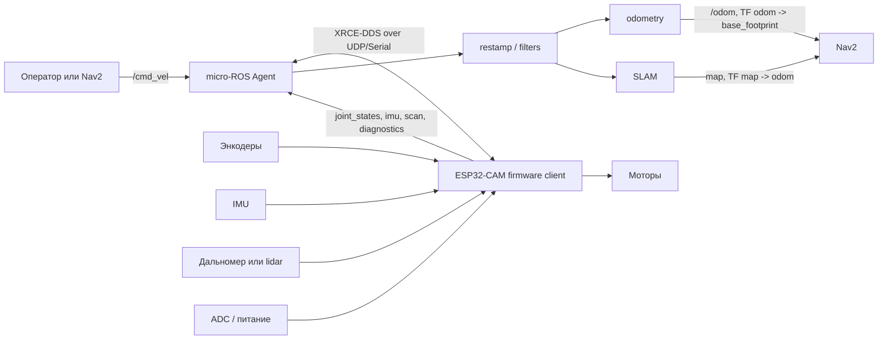

# micro-ROS в стеке ESP32-CAM мобильного робота

В статье показан рабочий подход к micro-ROS на примере ESP32-CAM платформы мобильного робота: микроконтроллер читает датчики и управляет моторами, а компьютер с ROS 2 запускает Agent, одометрию, TF, SLAM, Nav2 и инструменты диагностики.

В командах используются примерные имена пакетов и launch-файлов. В своем проекте замените их на реальные имена workspace, firmware-проекта и ROS 2 пакетов.

## 1. Где micro-ROS находится в системе

Обычная ROS 2 система рассчитана на Linux-компьютеры: ноутбук, Raspberry Pi, Jetson или промышленный ПК. Но часть задач мобильного робота удобнее держать на микроконтроллере:

- читать энкодеры, IMU, ADC и дальномер;
- управлять моторами с коротким периодом цикла;
- держать безопасное состояние при потере связи;
- включать и выключать питание датчиков;
- отправлять в ROS 2 уже готовую телеметрию.

micro-ROS связывает эти уровни:

- **micro-ROS Client** - firmware на микроконтроллере с `rcl`, `rclc`, publishers, subscriptions и executor;
- **transport** - UDP, serial, USB CDC или другой канал связи;
- **micro-ROS Agent** - процесс на компьютере, который переводит XRCE-DDS обмен клиента в обычный ROS 2 graph.

Для остальных ROS 2 нод микроконтроллер выглядит как обычная нода: он публикует топики, принимает команды и виден через `ros2 node list`.

Полезные источники:

- [micro-ROS documentation](https://micro.ros.org/docs/overview/features/)
- [micro-ROS Agent](https://github.com/micro-ROS/micro-ROS-Agent)
- [micro_ros_espidf_component](https://github.com/micro-ROS/micro_ros_espidf_component)

## 2. Архитектура ESP32-CAM робота

Типовая схема для маленького дифференциального робота:



Разделение ответственности:

- ESP32-CAM отвечает за близкую к железу часть: моторы, сенсоры, питание, timeout команд.
- Компьютер с ROS 2 отвечает за тяжелые алгоритмы: TF, SLAM, локализацию, Nav2, RViz, запись данных.
- Agent связывает эти два уровня и дает обычным ROS 2 инструментам доступ к микроконтроллеру.

Похожую аппаратную базу можно собрать на готовой машинке с ESP32-CAM, например на [Keyestudio ESP32 Vision smart car](https://www.ozon.ru/product/keyestudio-umnaya-mashina-esp32-vision-dlya-robota-arduino-s-kameroy-esp32-2728883926/?at=79tn0BxogC19qJ5CE0GW5NhmKnXwVhP3p0j7uXoP731).

## 3. ROS-контракт микроконтроллера

Перед firmware-кодом нужно описать ROS-интерфейс:

1. какие команды приходят с компьютера;
2. какие данные публикует микроконтроллер;
3. какие типы сообщений используются;
4. какой QoS нужен для каждого топика;
5. какие `frame_id` и timestamp будут у сенсорных сообщений.

Минимальный контракт для дифференциальной базы:

| Направление | Топик | Тип | Назначение |
|---|---|---|---|
| ROS 2 -> ESP32 | `/cmd_vel` | `geometry_msgs/msg/Twist` | команда линейной и угловой скорости |
| ESP32 -> ROS 2 | `/joint_states` | `sensor_msgs/msg/JointState` | положение и скорость колес |
| ESP32 -> ROS 2 | `/imu/data_raw` | `sensor_msgs/msg/Imu` | ускорения и угловая скорость |
| ESP32 -> ROS 2 | `/scan` | `sensor_msgs/msg/LaserScan` | дальномер или lidar |
| ESP32 -> ROS 2 | `/battery_voltage` | `std_msgs/msg/Float32` | напряжение питания |
| ESP32 -> ROS 2 | `/firmware_heartbeat` | `std_msgs/msg/Bool` | признак, что firmware жив |

Дополнительные команды можно добавлять отдельно:

| Направление | Топик | Тип | Назначение |
|---|---|---|---|
| ROS 2 -> ESP32 | `/lights_command` | `std_msgs/msg/Bool` | включить или выключить дополнительный выход |
| ROS 2 -> ESP32 | `/imu_calibrate_command` | `std_msgs/msg/Bool` | запустить калибровку IMU |
| ROS 2 -> ESP32 | `/aux_demand_mask` | `std_msgs/msg/Int16` | запросить питание дополнительных датчиков |

Для сенсоров часто выбирают best-effort QoS: лучше получить свежий следующий пакет, чем задерживать систему ради старого сообщения. Для команд движения важно проверять задержку и timeout на стороне firmware.

## 4. Типовая структура проекта

Пример структуры проекта:

```text
esp32_cam_micro_ros_robot/
  firmware/
    esp32cam/
      platformio.ini
      sdkconfig.defaults
      src/
        main.c
        microros_node.c
        motor_control.c
        sensors.c
  ros2_ws/
    src/
      esp32_cam_robot_description/
      esp32_cam_robot_base/
      esp32_cam_robot_bringup/
      esp32_cam_robot_navigation/
```

Роли частей:

| Часть | Что содержит |
|---|---|
| `firmware/esp32cam` | ESP-IDF или PlatformIO firmware, micro-ROS client, драйверы моторов и датчиков |
| `description` | URDF/Xacro, фреймы `base_link`, `base_footprint`, `laser_link`, `imu_link` |
| `base` | restamp, odometry, фильтры и вспомогательные ROS 2 ноды |
| `bringup` | launch-файлы для Agent, robot_state_publisher, odometry, RViz |
| `navigation` | параметры SLAM, map server, AMCL, Nav2 |

Имена пакетов могут быть любыми, но разделение помогает не смешивать firmware, описание робота и высокоуровневые алгоритмы.

## 5. Agent, transport и domain

Agent запускается на компьютере, где уже настроено ROS 2 окружение.

UDP-вариант:

```bash
source /opt/ros/jazzy/setup.bash
export ROS_DOMAIN_ID=42
ros2 run micro_ros_agent micro_ros_agent udp4 --port 8888 -v6
```

Serial-вариант:

```bash
source /opt/ros/jazzy/setup.bash
export ROS_DOMAIN_ID=42
ros2 run micro_ros_agent micro_ros_agent serial --dev /dev/ttyUSB0 -v6
```

Выбор транспорта:

| Transport | Когда использовать |
|---|---|
| UDP по Wi-Fi | мобильный робот ездит без кабеля |
| UDP по Ethernet | надежная лабораторная сеть |
| Serial по USB-UART | первая отладка firmware на столе |
| USB CDC | плата имеет нативный USB и нужен простой кабельный стенд |

Для Wi-Fi firmware должен знать IP компьютера с Agent. `127.0.0.1` не подходит: для ESP32 это сам ESP32, а не ноутбук.

## 6. Firmware: порядок инициализации

В firmware micro-ROS обычно поднимается в отдельной задаче:

```text
init_messages()
configure_transport()
set_domain_id()
create_node()
create_publishers()
create_subscriptions()
create_executor()
loop:
  publish_telemetry()
  spin_executor()
  check_cmd_vel_timeout()
```

На что обратить внимание:

- строки и массивы сообщений нужно инициализировать заранее;
- `LaserScan.ranges`, `JointState.name`, `JointState.position` требуют выделенной памяти;
- callback `/cmd_vel` не должен долго выполняться;
- управление моторами лучше держать в отдельном control loop;
- при потере `/cmd_vel` firmware должен остановить робота по timeout;
- при потере Agent firmware должен пытаться переподключиться или перейти в безопасный режим.

Пример логики `/cmd_vel`:

```text
cmd_vel_callback(msg):
  target_linear = clamp(msg.linear.x)
  target_angular = clamp(msg.angular.z)
  last_cmd_time = now()

control_loop:
  if now() - last_cmd_time > timeout:
    stop_motors()
  else:
    left, right = diff_drive_inverse_kinematics(target_linear, target_angular)
    set_motor_commands(left, right)
```

Для дифференциальной базы:

```text
v_left  = v_linear - omega * wheel_separation / 2
v_right = v_linear + omega * wheel_separation / 2
```

## 7. Проверка ROS-графа

После запуска Agent и firmware проверьте, что микроконтроллер появился в ROS 2 graph:

```bash
ros2 node list
ros2 topic list -t
```

Проверьте топики:

```bash
ros2 topic info /cmd_vel --verbose
ros2 topic echo /joint_states --once
timeout 8 ros2 topic hz /joint_states || true
timeout 8 ros2 topic hz /imu/data_raw || true
```

Проверьте команду движения только на безопасном стенде:

```bash
ros2 topic pub --once /cmd_vel geometry_msgs/msg/Twist \
  "{linear: {x: 0.05}, angular: {z: 0.0}}"
sleep 1
ros2 topic pub --once /cmd_vel geometry_msgs/msg/Twist \
  "{linear: {x: 0.0}, angular: {z: 0.0}}"
```

Если робот едет не туда, не пытайтесь сразу чинить Nav2. Сначала проверьте:

- знак моторов;
- знак энкодеров;
- порядок левого и правого колеса;
- `wheel_radius` и `wheel_separation`;
- ориентацию IMU;
- frame_id и положение датчиков в URDF.

## 8. Время сообщений и restamp

У микроконтроллера и компьютера разные часы. Если ESP32 публикует timestamp по своему внутреннему таймеру, ROS 2 алгоритмы могут считать сообщения слишком старыми или будущими.

Для учебного робота есть два нормальных варианта:

1. синхронизировать время и публиковать корректные timestamp прямо с firmware;
2. на хосте переписывать timestamp сенсорных сообщений в wall time.

Второй вариант проще для старта. Обычно делают отдельные ноды:

| Нода | Вход | Выход |
|---|---|---|
| `joint_state_restamper` | `/joint_states` | `/joint_states_tf` |
| `laser_scan_restamper` | `/scan` | `/scan_wall_time` |

Дальше `robot_state_publisher`, odometry, SLAM, AMCL и costmap используют уже restamp-топики.

## 9. Odometry, TF и SLAM

Минимальный ROS 2 pipeline после micro-ROS:

```text
/joint_states -> restamp -> odometry -> /odom + TF odom -> base_footprint
/scan -> restamp -> slam_toolbox -> /map + TF map -> odom
URDF -> robot_state_publisher -> TF base_footprint -> sensors
```

Проверки:

```bash
ros2 topic echo /odom --once
timeout 8 ros2 topic hz /scan_wall_time || true
timeout 8 ros2 run tf2_ros tf2_echo odom base_footprint || true
```

Для SLAM:

```bash
ros2 launch esp32_cam_robot_bringup slam.launch.py
```

Ожидаемые признаки:

- `/scan_wall_time` обновляется;
- `/odom` обновляется;
- TF `odom -> base_footprint` есть;
- `slam_toolbox` публикует `/map`;
- в RViz карта строится без резких разворотов и скачков.

## 10. Nav2

Nav2 подключайте после того, как отдельно проверены:

- `/cmd_vel` двигает робота в правильную сторону;
- `/joint_states` и `/odom` имеют правильные знаки;
- lidar или дальномер публикует стабильный `/scan`;
- TF-дерево непрерывное;
- карта сохранена и соответствует помещению.

Типовой запуск:

```bash
ros2 launch esp32_cam_robot_bringup nav.launch.py \
  map:=/path/to/map.yaml
```

Проверки:

```bash
ros2 action list | grep navigate_to_pose
timeout 8 ros2 topic hz /odom || true
timeout 8 ros2 topic hz /scan_wall_time || true
timeout 8 ros2 run tf2_ros tf2_echo map base_footprint || true
```

Если Nav2 не едет:

- если `/cmd_vel` не появляется, проблема чаще в AMCL, costmap, lifecycle или TF;
- если `/cmd_vel` есть, но робот не двигается, проблема ближе к firmware, питанию или драйверу моторов;
- если робот едет, но теряется, проверьте карту, lidar, footprint и initial pose.

## 11. Практика без конкретного железа

Если у вас нет ESP32-CAM машинки, выполните проектирование и проверки без аппаратного запуска:

1. запустите `micro_ros_agent` и разберите его параметры;
2. изучите структуру firmware client: transport, node, publishers, subscriptions, executor;
3. спроектируйте ROS-контракт своего микроконтроллера;
4. нарисуйте TF-дерево робота;
5. напишите таблицу топиков и QoS;
6. подготовьте launch-схему: Agent, restamp, odometry, RViz;
7. опишите, какие проверки должны пройти до SLAM и Nav2.

Результат этапа: описаны transport, топики, QoS, timestamp, TF-дерево и порядок диагностики.

## 12. Типовые ошибки

### Микроконтроллер не появляется в ROS 2 graph

Проверьте:

```bash
echo $ROS_DOMAIN_ID
ros2 node list
```

Частые причины:

- Agent слушает не тот transport или порт;
- firmware отправляет данные на неверный IP;
- ESP32 и компьютер в разных сетях;
- firewall блокирует UDP;
- `ROS_DOMAIN_ID` не совпадает;
- serial device указан неверно.

### Топики есть, но сообщения не приходят

Проверьте:

```bash
ros2 topic list -t
ros2 topic info /joint_states --verbose
timeout 8 ros2 topic hz /joint_states || true
```

Частые причины:

- publisher создан, но publish loop не вызывается;
- сообщение не инициализировано полностью;
- массивы в сообщениях имеют неверный `size` или `capacity`;
- QoS publisher и subscriber плохо совместимы;
- firmware зависает в callback.

### SLAM строит плохую карту

Проверьте:

- направление вращения колес и энкодеров;
- yaw IMU;
- `laser_link` в URDF;
- свежесть `/scan_wall_time`;
- `wheel_radius` и `wheel_separation`;
- отсутствие ручного переноса робота во время SLAM.

## 13. Итоговое задание

Зачетный сценарий:

1. Объяснить роли micro-ROS Client, Agent, transport и ROS 2 graph.
2. Выбрать transport для ESP32-CAM робота и объяснить выбор.
3. Составить таблицу топиков микроконтроллера: команды, сенсоры, диагностика.
4. Показать команды запуска Agent для UDP и serial.
5. Показать ROS 2 CLI-команды для проверки node graph, типов, QoS и частот.
6. Объяснить, зачем нужны timeout `/cmd_vel`, restamp и проверка TF.
7. Описать, какие условия должны быть выполнены перед запуском SLAM и Nav2.

## Вопросы для самопроверки

1. Почему micro-ROS Agent запускается на компьютере, а не на ESP32?
2. Чем `/cmd_vel` отличается от прямой команды моторам?
3. Почему для сенсоров часто выбирают best-effort QoS?
4. Что нужно заранее выделить в firmware перед публикацией сообщений?
5. Почему `127.0.0.1` не подходит как IP micro-ROS Agent для реального ESP32?
6. Зачем нужны restamp-узлы?
7. Кто публикует TF `odom -> base_footprint`, а кто публикует `map -> odom`?
8. Почему Nav2 нельзя запускать до проверки знаков моторов, энкодеров и IMU?
