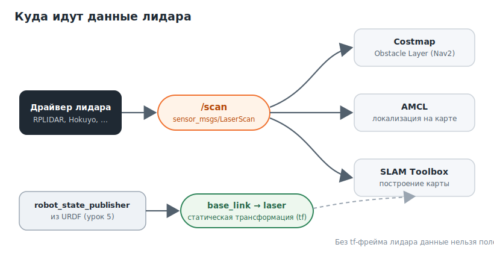

# 2D-лидар: сенсор навигации

## Цель туториала

Понять, что такое 2D-лидар и сообщение **LaserScan**, как данные лидара попадают в Nav2 (costmap, AMCL, SLAM) и какой tf-фрейм для этого обязателен. Отдельно разберём **лидарную одометрию** как альтернативу колёсной. После статьи вы сможете подключить 2D-лидар к своему роботу и проверить, что Nav2 его «видит». Про 3D-лидары — в [следующей статье](https://github.com/GeBondar/mobile-robotics-basics/blob/main/lesson%209%20(NAV2)/nav2_lidar_3d.md).

---

## Что такое 2D-лидар

**Лидар (LiDAR)** измеряет расстояние до препятствий, посылая лазерный луч и засекая время его возврата. **2D-лидар** вращает луч в одной горизонтальной плоскости и за один оборот выдаёт набор дальностей по кругу — «срез» окружения на высоте установки сенсора.

Именно этот срез видят costmap из [статьи про costmap](https://github.com/GeBondar/mobile-robotics-basics/blob/main/lesson%209%20(NAV2)/nav2_costmaps.md) и локализация AMCL.


В ROS 2 результат одного скана — это сообщение **`sensor_msgs/msg/LaserScan`**. Полезно понимать его поля, потому что через них настраиваются сенсорные слои costmap:

| Поле                    | Что означает                                                         |
| ----------------------- | -------------------------------------------------------------------- |
| `ranges[]`              | Массив дальностей: по одному значению на каждый луч                  |
| `angle_min`, `angle_max`| Границы углового сектора сканирования (в радианах)                   |
| `angle_increment`       | Угловой шаг между соседними лучами                                   |
| `range_min`, `range_max`| Рабочий диапазон дальностей; значения вне его считаются недостоверными |
| `intensities[]`         | Сила отражения луча (есть не у всех моделей)                         |
| `header.frame_id`       | Фрейм, в котором заданы измерения (фрейм лидара, например `laser`)   |

Угол `i`-го луча вычисляется как `angle_min + i * angle_increment`, а его дальность лежит в `ranges[i]`. Этого достаточно, чтобы перевести скан в точки на плоскости.

---


## Как данные лидара попадают в Nav2

Драйвер лидара публикует сканы в топик (обычно это **`/scan`**), а дальше один и тот же поток данных используют сразу несколько потребителей:



| Потребитель           | Зачем нужен лидар                                                                |
| --------------------- | -------------------------------------------------------------------------------- |
| **Obstacle Layer**    | Отмечает препятствия в costmap по сканам и очищает свободные ячейки              |
| **AMCL**              | Сопоставляет скан с картой и определяет позу робота (`map -> odom`)             |
| **SLAM Toolbox**      | Строит карту по сканам (этап до навигации)                                       |
| **Лидарная одометрия**| Может оценивать движение робота по сканам (см. раздел ниже)                       |

Чтобы любой из них смог положить точки скана на плоскость, ему нужно знать, **где на роботе стоит лидар**. Это задаётся tf-трансформацией `base_link -> laser`, которую `robot_state_publisher` берёт из URDF (см. [урок 5](https://github.com/GeBondar/mobile-robotics-basics/blob/main/lesson%205%20(URDF%20and%20XACRO)/understanding_URDF.md) и [урок 7](https://github.com/GeBondar/mobile-robotics-basics/blob/main/lesson%207%20(TF2)/introducing_tf2.md)). Без этого фрейма Nav2 не сможет использовать лидар, даже если топик `/scan` исправно публикуется.

Привязка скана к costmap делается в параметрах Obstacle Layer — указывается источник наблюдений и его топик:

```
obstacle_layer:
  plugin: "nav2_costmap_2d::ObstacleLayer"
  observation_sources: scan
  scan:
    topic: /scan
    data_type: "LaserScan"
    clearing: true
    marking: true
```

---


## Подключение и контрольные проверки

Сначала убедитесь, что драйвер лидара публикует сканы. Топик есть в списке:

```
ros2 topic list | grep scan
```

Посмотрите структуру сообщения и одно реальное измерение:

```
ros2 interface show sensor_msgs/msg/LaserScan
ros2 topic echo /scan --once
```

Проверьте частоту публикации — у типовых 2D-лидаров это 5–15 Гц:

```
ros2 topic hz /scan
```

Убедитесь, что фрейм лидара есть в дереве tf:

```
ros2 run tf2_ros tf2_echo base_link laser
```

Команда должна периодически печатать трансформацию. Если она сообщает, что фрейм не найден, проверьте URDF и `robot_state_publisher`.

Наконец, визуализируйте скан в **RViz2** (см. [урок 6](https://github.com/GeBondar/mobile-robotics-basics/blob/main/lesson%206%20(RViz2%20and%20rqt)/RViz_introduction.md)): добавьте display типа **LaserScan** с топиком `/scan` и задайте **Fixed Frame**, который существует в tf (например, `odom` или `base_link`). Вы увидите контур стен вокруг робота.

---


## Лидарная одометрия

Напомним из [статьи про Nav2](https://github.com/GeBondar/mobile-robotics-basics/blob/main/lesson%209%20(NAV2)/introducing_nav2.md): трансформацию `odom -> base_link` обычно публикует нода одометрии по колёсным энкодерам. Но колёсная одометрия плоха при проскальзывании колёс, на неровном полу или когда энкодеров нет вовсе.

**Лидарная одометрия** оценивает движение робота напрямую по сканам, без колёс. Принцип — **сопоставление сканов (scan matching)**: алгоритм находит сдвиг и поворот, при котором два последовательных скана совмещаются лучше всего. Этот сдвиг и есть перемещение робота.


Как и колёсная, лидарная одометрия **накапливает ошибку (дрейф)** — это нормально. Её задача — давать гладкую `odom -> base_link`, а накопленный дрейф потом исправляет локализация (`map -> odom`).

Писать scan matching с нуля не нужно — есть готовые ноды:

| Алгоритм / нода          | Идея                                                              | Репозиторий                                                                 |
| ------------------------ | ----------------------------------------------------------------- | --------------------------------------------------------------------------- |
| **RF2O**                 | Оценка плоского движения по градиентам дальностей; очень быстрый  | [MAPIRlab/rf2o_laser_odometry](https://github.com/MAPIRlab/rf2o_laser_odometry/tree/ros2) (ветка `ros2`), ROS 2 форк [linuxsen/rf2o_laser_odometry_ros2](https://github.com/linuxsen/rf2o_laser_odometry_ros2) |
| **laser_scan_matcher**   | Классическое сопоставление сканов (PLICP)                         | [index.ros.org/p/laser_scan_matcher](https://index.ros.org/p/laser_scan_matcher/) |
| **SLAM Toolbox**         | Сопоставление сканов внутри SLAM (используется при построении карты) | [docs.ros.org/.../slam_toolbox](https://docs.ros.org/en/jazzy/p/slam_toolbox/) |

Большинство таких нод принимают топик `/scan` и публикуют топик одометрии вместе с трансформацией `odom -> base_link` — то есть встают на то же место, что и колёсная одометрия. Перед использованием проверьте, что нода собирается под ваш дистрибутив (`$ROS_DISTRO`).

> Практический ориентир: для робота с надёжными энкодерами лидарную одометрию обычно добавляют как дополнение (через фильтр вроде `robot_localization`), а как основной источник — когда колёсная одометрия недоступна или ненадёжна.

---


## Итог

- 2D-лидар выдаёт сообщение `LaserScan` — набор дальностей по кругу; его поля задают геометрию скана.
- Один топик `/scan` питает сразу costmap, AMCL и SLAM; для всех обязателен tf-фрейм лидара (`base_link -> laser` из URDF).
- Лидарная одометрия оценивает движение через сопоставление сканов и заменяет/дополняет колёсную; готовые ноды — RF2O, laser_scan_matcher.


## Внешние источники

- [sensor_msgs/LaserScan](https://docs.ros.org/en/jazzy/p/sensor_msgs/interfaces/msg/LaserScan.html)
- [Nav2: Costmap2D и сенсорные слои](https://docs.nav2.org/configuration/packages/configuring-costmaps.html)
- [RF2O Laser Odometry](https://github.com/MAPIRlab/rf2o_laser_odometry/tree/ros2)
