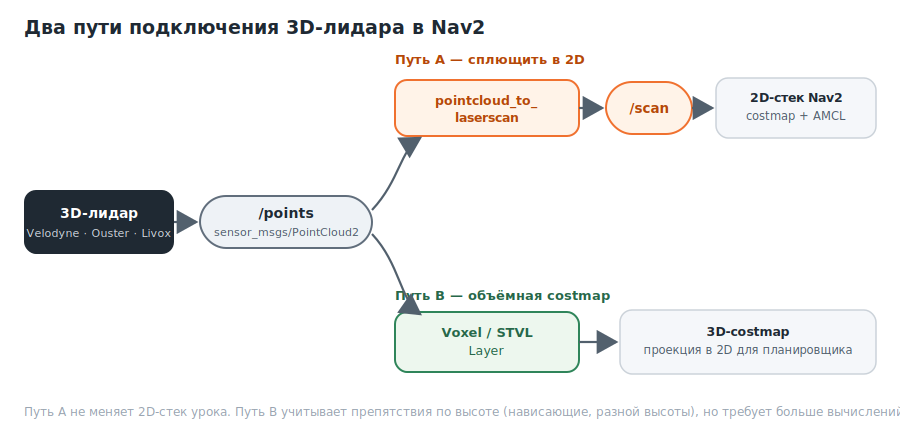

# 3D-лидар: объёмное восприятие

## Цель туториала

Понять, чем 3D-лидар отличается от 2D, что такое сообщение **PointCloud2**, когда 3D действительно нужен и как подключить его к Nav2 — двумя способами. Отдельно разберём **3D-лидарную одометрию**. Это продолжение статьи про [2D-лидар](https://github.com/GeBondar/mobile-robotics-basics/blob/main/lesson%209%20(NAV2)/nav2_lidar_2d.md): рекомендуется сначала прочитать её.

---


## Что такое 3D-лидар

**3D-лидар** сканирует не одну горизонтальную плоскость, а сразу много, и за один кадр выдаёт **облако точек** — тысячи измерений `(x, y, z)`. В отличие от 2D-лидара, который видит только срез на высоте сенсора, 3D «видит» объёмную форму препятствий.


По устройству 3D-лидары делятся на **механические** (вращающийся блок лучей: Velodyne, Ouster) и **твердотельные** (без вращения, узкий сектор: Livox).

В ROS 2 кадр 3D-лидара — это сообщение **`sensor_msgs/msg/PointCloud2`**. В отличие от `LaserScan` (плоский массив дальностей), это бинарный буфер точек с описанием полей:

| Поле                 | Что означает                                                       |
| -------------------- | ------------------------------------------------------------------ |
| `fields`             | Описание полей каждой точки: какие есть и какого типа              |
| `x`, `y`, `z`        | Координаты точки в пространстве (типичные поля)                    |
| `intensity`          | Сила отражения (если предоставляется сенсором)                    |
| `ring` / `t`         | Номер «кольца» лучей и время точки (нужны для алгоритмов одометрии) |
| `height`, `width`    | Размеры структуры облака (организованного или нет)                 |
| `header.frame_id`    | Фрейм лидара, как и у `LaserScan`                                  |

Ключевое отличие от 2D: у точки есть координата `z`, поэтому облако описывает препятствия на разной высоте, а не один срез.

---


## Когда нужен 3D, а когда хватает 2D

3D-лидар решает проблемы, которые в принципе не видны 2D-сенсору:

| Ситуация                                          | 2D-лидар              | 3D-лидар        |
| ------------------------------------------------- | --------------------- | --------------- |
| Препятствие на высоте сканирующей плоскости       | Видит                 | Видит           |
| **Нависающее препятствие** (столешница, полка)    | Не видит (срез ниже)  | Видит           |
| **Низкое препятствие** (порог, ступенька, кабель) | Не видит (срез выше)  | Видит           |
| Обрывы и спуски (лестница вниз)                    | Не видит              | Видит           |
| Вычислительная нагрузка и цена                     | Низкие                | Заметно выше    |

Вывод простой: для плоского помещения с препятствиями «в полный рост» обычно достаточно 2D — он дешевле и проще. 3D берут, когда важны препятствия по высоте, перепады уровня или работа на улице.

---


## Как 3D-данные попадают в Nav2

Навигационный стек этого урока — **2D**: планировщик и контроллер в итоге работают с плоской costmap. Подключить к нему 3D-лидар можно двумя путями:



**Путь A — сплющить облако в 2D.** Нода [pointcloud_to_laserscan](https://github.com/ros-perception/pointcloud_to_laserscan) берёт точки из заданного диапазона высот и превращает их в обычный `LaserScan`. На выходе — топик `scan`, и весь 2D-стек из предыдущей статьи работает без изменений. Это самый простой путь, но часть объёмной информации теряется.

**Путь B — объёмная costmap.** Costmap умеет принимать `PointCloud2` напрямую через слои, которые работают с высотой:

- **Voxel Layer** — встроенный слой Nav2; ведёт 3D-модель из вокселей (объёмных «пикселей») и проецирует её в 2D для планирования.
- **Spatio-Temporal Voxel Layer (STVL)** — внешний плагин; хранит разреженную воксельную сетку с затуханием во времени и эффективнее работает с плотными 3D-данными. Препятствия учитываются по высоте через `min_obstacle_height` / `max_obstacle_height`.

Для Voxel Layer источник `PointCloud2` указывается так же, как `/scan` в Obstacle Layer, только с другим типом данных:

```
voxel_layer:
  plugin: "nav2_costmap_2d::VoxelLayer"
  observation_sources: pointcloud
  pointcloud:
    topic: /points
    data_type: "PointCloud2"
    min_obstacle_height: 0.05
    max_obstacle_height: 2.0
    marking: true
    clearing: true
```

STVL подключается как внешний плагин costmap (`spatio_temporal_voxel_layer/SpatioTemporalVoxelLayer`) и настраивается аналогично — см. документацию Nav2.

---


## Подключение и контрольные проверки

Убедитесь, что лидар публикует облако, и посмотрите его поля:

```
ros2 topic list | grep points
ros2 interface show sensor_msgs/msg/PointCloud2
```

Проверьте, что в облаке есть нужные поля (`x`, `y`, `z`, при необходимости `intensity`, `ring`, `t`), и частоту публикации:

```
ros2 topic echo /points --field fields --once
ros2 topic hz /points
```

Проверьте tf-фрейм лидара — как и для 2D, без него точки нельзя положить на карту:

```
ros2 run tf2_ros tf2_echo base_link <фрейм_лидара>
```

В **RViz2** добавьте display типа **PointCloud2** с топиком `/points` и задайте существующий **Fixed Frame**. Вы увидите объёмное облако точек вокруг робота.

---


## 3D-лидарная одометрия

Принцип тот же, что у 2D (см. предыдущую статью) движение оценивается совмещением двух последовательных кадров. Только вместо плоских сканов совмещаются облака точек, а движение определяется уже в **6 степенях свободы** (`x, y, z` и три поворота), а не в трёх.


Совмещение облаков называется **регистрацией**; базовые методы — point-to-point ICP и NDT. Часто к лидару добавляют **IMU** (инерциальный датчик): связку «лидар + IMU» называют **LIO (LiDAR-Inertial Odometry)** — она точнее и устойчивее при быстрых движениях и в бедных на детали сценах.

Готовые пакеты:

| Пакет             | Особенность                                                   | Репозиторий                                                              |
| ----------------- | ------------------------------------------------------------- | ----------------------------------------------------------------------- |
| **KISS-ICP**      | Чистый point-to-point ICP, без IMU; работает «из коробки»     | [PRBonn/kiss-icp](https://github.com/PRBonn/kiss-icp) (поддержка ROS 2) |
| **kinematic-icp** | ICP с учётом кинематики колёсного робота                      | [PRBonn/kinematic-icp](https://github.com/PRBonn/kinematic-icp)         |
| **FAST-LIO2**     | LIO на итеративном фильтре Калмана; spinning и solid-state    | [hku-mars/FAST_LIO](https://github.com/hku-mars/FAST_LIO), ROS 2 порт [Ericsii/FAST_LIO_ROS2](https://github.com/Ericsii/FAST_LIO_ROS2) |
| **LIO-SAM**       | LIO на факторном графе; требует 9-осевой IMU                  | [TixiaoShan/LIO-SAM](https://github.com/TixiaoShan/LIO-SAM/tree/ros2) (ветка `ros2`) |

Как и у 2D, на выходе — трансформация `odom -> base_link`, которая встаёт на место колёсной одометрии. LIO-пакеты дополнительно требуют синхронизированный с лидаром IMU; проверяйте поддержку вашего дистрибутива (`$ROS_DISTRO`) и тип лидара.

---


## Итог

- 3D-лидар выдаёт `PointCloud2` — облако точек с координатой `z`; видит препятствия по высоте, которые 2D пропускает.
- 2D достаточно для плоских помещений; 3D берут ради нависающих/низких препятствий и перепадов уровня, ценой вычислений и стоимости.
- В 2D-стек Nav2 3D-лидар подключают через `pointcloud_to_laserscan` (путь A) или через объёмные слои Voxel/STVL (путь B).
- 3D-одометрия — регистрация облаков (KISS-ICP) или связка с IMU (LIO: FAST-LIO2, LIO-SAM); оценивает движение в 6 степенях свободы.


## Внешние источники

- [sensor_msgs/PointCloud2](https://docs.ros.org/en/jazzy/p/sensor_msgs/interfaces/msg/PointCloud2.html)
- [pointcloud_to_laserscan](https://github.com/ros-perception/pointcloud_to_laserscan)
- [Nav2: Voxel Layer](https://docs.nav2.org/configuration/packages/costmap-plugins/voxel.html)
- [Nav2: подключение STVL](https://docs.nav2.org/tutorials/docs/navigation2_with_stvl.html)
- [KISS-ICP](https://github.com/PRBonn/kiss-icp)

